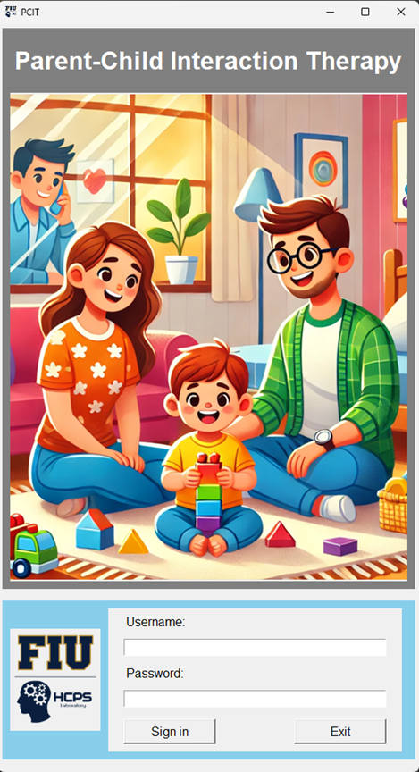
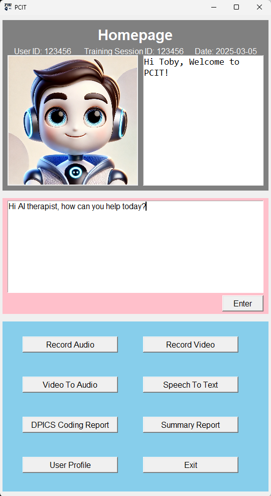

# AI-Powered Closed-Loop Intervention to Promote a Supportive and Interactive Environment around Children

Welcome to the **PCITapp** repository. This project is a demo of our proprietary solution. Due to confidentiality and data privacy, the source code is not available. Instead, we have provided visual representations of the key features below.

---

## Overview

Our demo showcases:
- **Innovative User Experience:** An intuitive interface and seamless workflow.
- **Cutting-Edge Technology:** Advanced features that set our solution apart.
- **Real-World Applications:** How our demo addresses critical challenges.

---

## Screenshots

### Home Screen

*The main landing page of our demo application.*

### Dashboard Overview

*A snapshot of the interactive dashboard with key metrics.*

### Feature Spotlight

*An in-depth view of one of our standout features.*

---

## To-Do List

Below is the current roadmap for our demo project:

1. **Settings:**
  - [x] Profiles: User’s ID, Training Session ID, and Date of Recording 
  - [x] Profiles and Selection of Decoding Model

2. **Input Media:** 
  - [x] Audio Recording of a therapy/practice Session 
  - [x] Video Recording of a therapy/practice Session
  - [ ] Online Audio Streaming of a therapy/practice Session (Real-time simulation with Simultaneous Streaming and DPICS coding)
  - [ ] Online Video Streaming of a therapy/practice Session (Real-time simulation with Simultaneous Streaming and DPICS coding)

3. **Text Data Conversion (Speech-to-text and automatic speech recognition(ASR)):**
  - [x] Cloud-based ASR
  - [x] On-Device ASR
  - [ ] On-Device/Cloud-based google translate 

4. **DPICS Coding:**
  - [x] On-Device DPICS coding AI model for Parent’s verbal behaviors (10 DPICS codes) 
  - [x] Cloud LLM-based DPICS coding for Parent’s verbal behaviors (10 DPICS codes) - In-context learning with DPICS manual
  - [ ] Cloud LLM-based DPICS coding for Parent’s verbal behaviors (10 DPICS codes) - Finetuned model 
  - [ ] Cloud LLM-based DPICS coding for Parent’s verbal behaviors (10 DPICS codes) - RLHF Finetuned model
  - [ ] On-device finetuned small-sized Llama model-based DPICS coding for Parent’s verbal behaviors (10 DPICS codes) - Knowledge distillation
  - [ ] Cloud LLM-based DPICS coding for Parent and Child’s verbal, vocal, and physical behaviors - Refined with in-context learning
  - [ ] Cloud LLM-based DPICS coding for Parent and Child’s verbal, vocal, and physical behaviors – RLHF Finetuned model  

5. **Output Display Media:**
  - [x] PC-Python window 
  - [ ] Android Display
  - [ ] IOS phone Display
  - [ ] Pad Display

6. **Output DPICS Coding Report:**
  - [x] DPICS codes for each of verbal behaviors with timestamping 
  - [ ] DPICS codes for each of verbal, vocal, or physical behaviors with timestamping 

7. **Output Training Progress Summary Report:**
  - [x] Bar plots comparing critical PCIT skills (e.g., Labeled praise, Direct Commands every 5/10 minutes) between the current session and past sessions  
  - [ ] Gamification Elements: Introduce badges, rewards, or progress bars to celebrate achievements and maintain motivation. 

---

## How to Use This Demo

**Contact Us:**For additional information or to schedule a live demo, please contact our Lab Director, Dr. Ou Bai, at [obai@fiu.edu].

---

## About Us

We are a team dedicated to develop innovative, smart wearables, wireless networks, and computing technologies to accelerate both the creation and our understanding of the complex and increasingly coupled relationships between humans and robotics with a broad goal of advancing human capabilities. We have a strong interest in the Intent-of-Things (IoT) applications to explore novel technology that may promote better human interactions with the physical world, such as brain-computer interfaces (BCIs), neuroprostheses, and human-robot interactions. For more details about our projects and services, visit our website [(https://hcps.fiu.edu/)](https://hcps.fiu.edu/). 

---

*Thank you for exploring our demo!*
